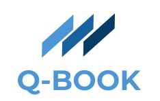

Q-Book is a python based limit order book simulator designed to showcase the basic functionality of real-world limit order books. Using a GUI, users can experiment with different settings for market orders, limit orders, cancellations, as well as see a market-making algorithm in action! 

